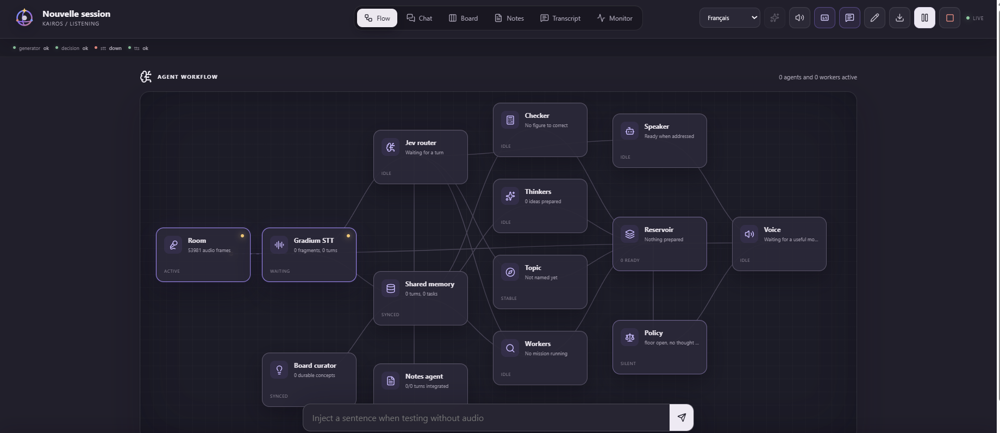
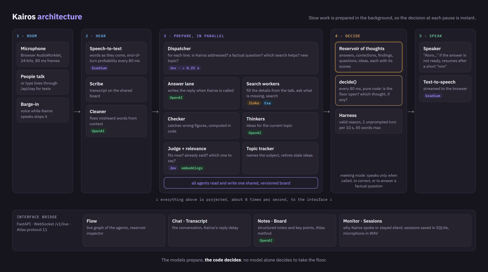
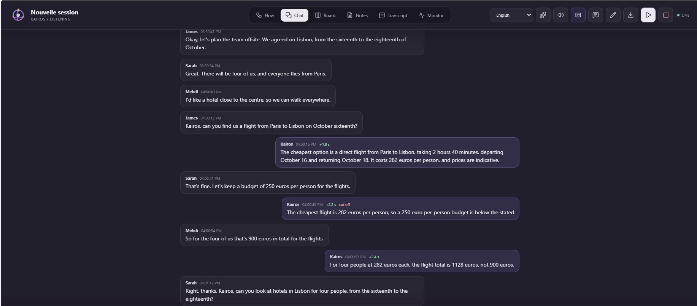
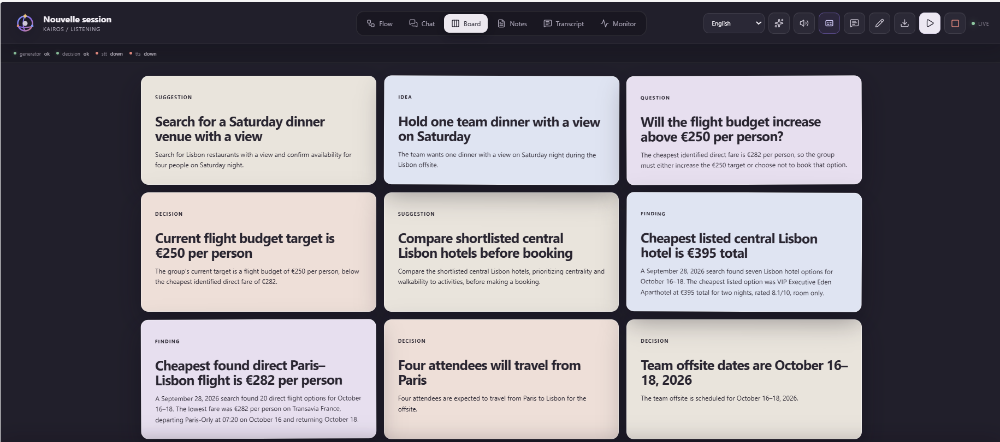
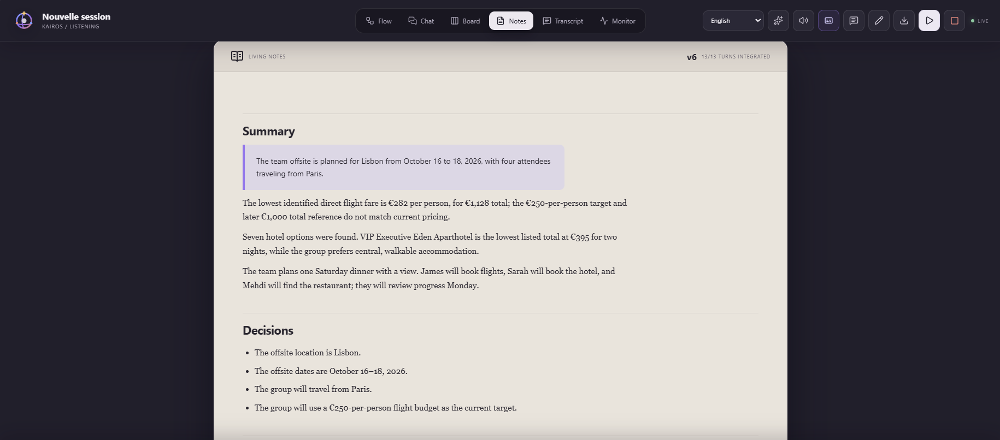
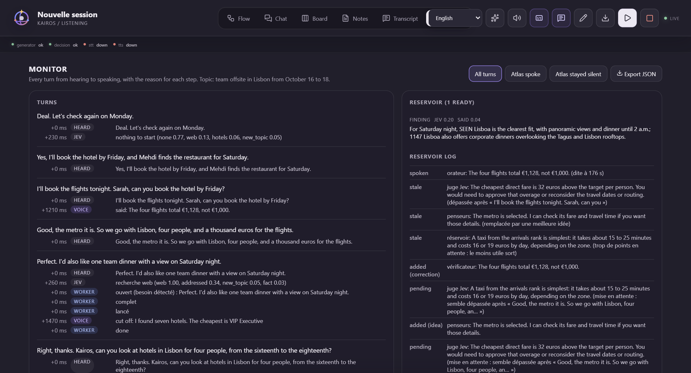

# Kairos

**A voice assistant for meetings that knows when to speak, and when to stay silent.**



Kairos is an agentic system that listens to a meeting and brings in information when it helps, without
disturbing the conversation. It is built on [Gradium](https://gradium.ai) (speech-to-text and voice),
[Jev by TypeSafe](https://typesafe.ai) (fast decisions), OpenAI (writing), [Exa](https://exa.ai) (web search)
and [Jinko](https://gojinko.com) (flights and hotels).

During a meeting, Kairos can:

- **Search live**: flights and hotels through Jinko; train times, restaurants, activities and recent news on
  the web through Exa.
- **Correct wrong statements**: a wrong total or a wrong fact said in the room. Figures are computed by code,
  not guessed by the model.
- **Take notes**: structured notes and a board of key points, updated as people talk, with a synthesis of the
  meeting when it ends.
- **Follow the conversation**: it answers when called and otherwise stays silent. Every time it speaks or
  keeps quiet, the reason is recorded.

**Next step:** a RAG layer over an organisation's own documents, so Kairos can bring in and correct key facts
about the company during important meetings. It is designed but not connected yet.



## The problem

Voice assistants either wait for a command or interrupt all the time. In a real conversation, the hard part
is not finding an answer: it is knowing *when* to speak, and when a good idea is better left unsaid.

Kairos prepares everything in the background (answers, searches, corrections) and only decides at each pause
whether one of them is worth saying. That decision is made by code, from scores the models compute ahead of
time, so it takes less than a millisecond and every choice can be explained.

## What Kairos does

### A concrete example

Three colleagues plan a team trip to Lisbon. They talk among themselves; Kairos stays silent until James
calls it. 1.8 seconds after his question, it answers with a real fare found by Jinko. When Sarah sets a
budget of 250 euros per person, Kairos points out that the cheapest flight costs 282; when Mehdi says the
flights will cost 900 euros for the four of them, it corrects the total, computed by code:



In the same meeting:

- Asked for hotels, it searched Jinko's live rates for four people and two nights and gave the two
  best-value options, with their rating and total price.
- Asked how to get from the airport to the centre, it said "Let me look", searched the web, and answered with
  the time and the price of a taxi.
- When Sarah later settled on "a thousand euros for the flights", it reminded the room that the four flights
  cost 1,128 euros.
- Everything else (who books what, the dinner plans) was left to the people, and went into the notes.

### What it can do

- **Answer when called** by name, right away, or with "Let me look" followed by the result.
- **Search**: flights and hotels with Jinko; train times, restaurants, activities and news on the web with
  Exa. It takes the details it can from the conversation and asks only for what is missing.
- **Correct wrong figures** said in the room.
- **Fill memory gaps**: "there was a big news story last week, I can't remember what it was" triggers a
  search.
- **Stay out of side conversations**: questions people ask each other are left to them.
- **Stop when interrupted**, and continue its sentence after a short "mm".

### Two modes

When you start a session, you choose how active Kairos is:

- **Speaks when called** (meeting mode): for several people. It answers when called, corrects wrong figures
  and answers factual questions, and takes no other initiative.
- **Speaks when a thought passes the threshold**: for one-to-one use. It also shares a prepared idea when it
  clearly beats saying nothing.

## The interface

The interface shows what Kairos hears, prepares and decides, live.

### Chat

The conversation as it happens. Each Kairos reply shows how long after the question it started (`+1.9 s`),
and whether someone cut it off. The Transcript view shows the same lines as raw text.

### Board

The key points of the meeting as cards: decisions, open questions, ideas, findings from Kairos's searches.
The board is rebuilt as the meeting goes: the model proposes the board it wants, and code decides which cards
to create, update, merge or retire, so nothing is lost or duplicated by accident.



### Notes

Living notes, rewritten every few lines: a summary, the decisions, the open questions and who committed to
what. They are updated one last time when the session ends.



### Flow and Monitor

**Flow** is the live graph of the agents (see the picture at the top): what each one is doing, and a click
on a node opens its details, such as the reservoir of prepared thoughts with their scores.

**Monitor** explains every turn: what was heard, what Jev decided to start (a search, an answer, nothing),
what the search workers did, and why Kairos spoke or stayed silent.



## Installation

You need:

- Python 3.11 or later
- [Bun](https://bun.sh), to build the interface
- API keys for the services below (at least OpenAI and Gradium)

```bash
git clone https://github.com/syldeha/kairos.git
cd kairos

python -m venv .venv
source .venv/bin/activate          # Windows: .venv\Scripts\activate
pip install -e ".[dev]"

cd frontend
bun install
bun run build
cd ..

cp .env.example .env               # Windows: copy .env.example .env
```

Then open `.env` and add your keys:

| Key | Used for | Needed |
|---|---|---|
| `OPENAI_API_KEY` | writing answers, notes and board | yes |
| `GRADIUM_API_KEY` | listening and speaking | yes, for voice |
| `TYPESAFE_API_KEY` | Jev, the fast decision classifier | recommended (without it, a slower fallback is used) |
| `EXA_API_KEY` | web search | optional |
| `JINKO_API_KEY` | flights and hotels | optional |

## Running it

```bash
python -m kairos.ui.server
```

Open http://127.0.0.1:8787, then:

1. Choose the language, "Microphone" as audio source, and the mode.
2. Click **New session** and allow the microphone.
3. Talk normally, and call Kairos by name when you need it.

Use headphones or a moderate volume, so Kairos does not hear itself. To test without a microphone, type
sentences in the "Inject a sentence" field at the bottom of the page.

Sessions are saved and listed on the home page. They stay on your machine: in
`~/.local/share/kairos/sessions.db`, and the microphone of each session in `runs/voice/`.

Optional settings, as environment variables:

- `KAIROS_PORT`: the port of the interface (default 8787).
- `KAIROS_THINK_MODEL`: the OpenAI model used for writing (default `gpt-5.6-luna`).
- `KAIROS_STT_DELAY`: how far ahead speech recognition listens, in 80 ms steps (default 16). Higher is more
  accurate but slower.

There is also a developer console showing every internal agent, useful for tuning:
`python -m kairos.server.app`, then http://127.0.0.1:8765.

## Tests

```bash
python -m pytest
```

The 149 tests run without network access. The interface has its own tests: in `frontend/`, run
`bun run test`.

`scripts/ui_scenarios.py` plays scripted conversations against a running server and reports how Kairos
behaved: calls answered, times it spoke when it should not have, response delays. You can watch them in the
Chat view. They use real API credits.

## Project structure

- `kairos/agents/`: the background agents (dispatcher, answer lane, search workers, checker, judge, notes).
- `kairos/decide/`: the rule that decides when to speak.
- `kairos/speaker.py`, `kairos/voice.py`: speaking, interruptions, the Gradium voice.
- `kairos/ui/`: the server behind the web interface, and the Notes and Board agent.
- `kairos/server/app.py`: the developer console.
- `frontend/`: the web interface.
- `scripts/`, `tests/`, `fixtures/`: scenarios, tests and scripted meetings.

## Limits

- With one microphone for several people, Kairos cannot tell who is speaking, and distant or overlapping
  voices are often transcribed badly. It relies on its name to know it is being called.
- Answers are written completely before being spoken, which adds about a second.
- Jinko covers flights and hotels only; trains and activities are searched on the web.
- Each session uses Gradium, OpenAI, TypeSafe and search credits.

## Team and credits

Kairos was built by the Mpackt team: Sylvain Dehayem, Ivann Harold Kamdem Pouokam and Wadoh Tchinda Pavel.
The web interface in `frontend/` comes from [Atlas](https://github.com/KpihX/atlas), the team's earlier
project.

It also builds on [thoughtful-agents](https://github.com/xybruceliu/thoughtful-agents) (Liu et al., CHI 2025),
where the idea of a reservoir of prepared thoughts comes from, and the
[AMI Meeting Corpus](https://groups.inf.ed.ac.uk/ami/corpus/) (CC BY 4.0), and uses
[Gradium](https://gradium.ai), [Jev by TypeSafe](https://typesafe.ai), [Exa](https://exa.ai) and
[Jinko](https://gojinko.com).
